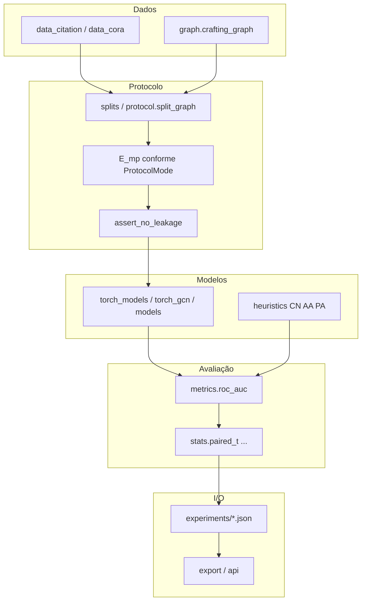
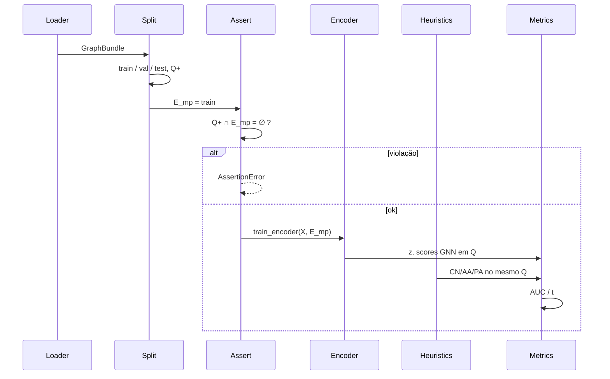

# Arquitetura do pacote `glue_lp` (expandido)

Figura esquemática: `figures/fig8_arquitetura.png`. Escada L: `figures/fig9_escada_vazamento.png`.

---

## Visão em camadas



```
dados LINQS / tech tree
        │
        ▼
  splits / protocol  ──►  EdgeSplit + assert Q+ ∩ E_mp = ∅
        │
        ▼
  torch_models / models  ──►  embeddings z
        │
        ├─► heuristics (CN/AA/PA) no mesmo Q
        └─► metrics (AUC, AP, Hits@K, MRR)
                │
                ▼
        experiments/*.json  ──►  export / API / manuscrito
```

---

## Formas de dados (domínio)

| Tipo | Módulo | Papel |
|---|---|---|
| `GraphBundle` | `types.py` | grafo em memória (nome, n, X, edges) |
| `EdgeSplit` | `types.py` | train/val/test + mp + negatives + mode |
| `ProtocolMode` | `types.py` | `"valid"` \| `"leaky"` |
| `LeakageLevel` | `types.py` | L0–L4 (enum); medidos L1/L3/L4 |
| `RunResult` | `types.py` | uma célula seed×mode×encoder |
| `TrainConfig` | `config.py` | hiperparâmetros congelados (medidos) |
| `ProtocolConfig` | `config.py` | fracionamentos e política de split |
| `DatasetSpec` | `config.py` | tamanhos Cora/Citeseer/Pubmed |

---

## Módulos

| Módulo | Dependência | Função |
|---|---|---|
| `graph.py` | puro | tech tree sintético (`Node`, `Edge`) |
| `protocol.py` | NumPy-free | split temporal/random + assert |
| `splits.py` | NumPy | holdout citação, negativos, indutivo |
| `data_citation.py` / `data_cora.py` | NumPy | loaders LINQS |
| `models.py` / `run.py` | NumPy | GNN sintético + harness ilustrativo |
| `torch_gcn.py` | torch | GCN denso (série 1) |
| `torch_models.py` | torch | GCN/SAGE/GAT esparsos + `train_encoder` |
| `heuristics.py` | NumPy | CN, Adamic–Adar, PA |
| `metrics.py` | puro | AUC Mann–Whitney (empate = ½) |
| `stats.py` | NumPy | t pareado, *d_z*, bootstrap, Holm (aplicar pós-re-run) |
| `export.py` | stdlib | ler summaries JSON |
| `logging_util.py` | stdlib | logging estruturado |
| `api.py` | FastAPI *opcional* | health / check / experiments |
| `integrations/` | stubs | PyG / DGL / OGB — **não medido** |

---

## Scripts

| Script | Saída | Nota |
|---|---|---|
| `run_e1_e4.py` | `cora_e1_e4.json` | Série 1; re-run P0 |
| `run_extended.py` | `extended_gcn_sage.json` | Série 2; re-run P0 |
| `run_wave3.py` | `wave3_gat_pubmed.json` | Onda 3; re-run P0 |
| `leakage_ladder.py` | `leakage_ladder_*.json` | Sintético (já re-medido na revisão) |
| `check_protocol.py` | CLI do assert | CI |
| `verify_results.py` | relê JSON | não retreina |
| `build_manuscript.py` | DOCX (+ PDF) | **não editar** (agente paralelo) |
| `make_figures.py` | fig1–fig7 | fig8/fig9 geradas à parte |
| `serve_protocol.py` | API opcional | read-only |
| `checksum_data.py` | SHA LINQS | usuário local |

---

## Fluxo de uma célula (valid)



---

## Invariante no código

A máscara não é comentário: `mp_edges` é argumento de `train_encoder` / `split_graph`. No modo `valid`, `assert_no_leakage` quebra o processo antes do treino.

---

## Limites arquiteturais conscientes

- Sem *mini-batch* SpotTarget-style em grafos web-scale.
- Sem Hits@K OGB até o stub virar loader medido.
- `TrainConfig` centraliza hipers; runners devem importar `DEFAULT_TRAIN` (evitar drift).
