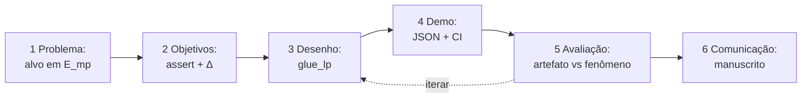

# Design Science — mapa do artefato GLUE-LP

> Enquadramento: Hevner et al. (2004), Peffers et al. (2007), Gregor & Hevner (2013).  
> Autoavaliação **honesta**: o que está operacional vs nominal.

---

## 1. Tipo de artefato (Gregor & Hevner, 2013)

| Tipo | Aplica? | Nota |
|---|---|---|
| *Invention* (novo gênero) | Não | Assert + exclusão de alvo já discutidos em SEAL/SpotTarget |
| **Improvement** | **Sim** | Torna exclusão **incontornável** (assert + CI + modos + escada L) |
| *Exaptation* | Parcial | DSR de SI aplicado a harness de ML/GNN |
| *Routine design* | Não | Não é só empacotar PyG |

**Contribuição reivindicável:** *improvement* de protocolo de avaliação de LP com GNN.

---

## 2. Ciclo DSRM (Peffers et al., 2007)

| Passo Peffers | Instanciação em GLUE-LP | Status |
|---|---|---|
| **1. Identificação do problema** | Tutoriais/Planetoid/PyG deixam \(Q^{+}\) em \(E_{mp}\); métrica sobe; produção não vê a aresta futura | Documentado (§1 ARTIGO); evidência SpotTarget/HeaRT |
| **2. Objetivos da solução** | (O1) Invariante verificável; (O2) Δ valid vs leaky mensurável; (O3) Heurísticas no mesmo \(Q\); (O4) CI sem GPU | Explícitos neste doc |
| **3. Desenho e desenvolvimento** | Pacote `glue_lp`: `protocol.assert_no_leakage`, `splits`, `torch_models`, `heuristics`, runners, tipos `LeakageLevel` | Código no repositório |
| **4. Demonstração** | Séries 1–2, onda 3 (LINQS); escada L1/L3/L4 (sintético); `pytest`; `check_protocol.py` | JSON em `experiments/` |
| **5. Avaliação** | Ver §3 abaixo — **separar** artefato vs fenômeno | Parcial: ameaça pré-fix (P0) |
| **6. Comunicação** | `docs/ARTIGO.md`, PDF/DOCX, docs auxiliares, README | Em curso; afiliação placeholder |

---

## 3. Avaliação do **artefato** vs avaliação do **fenômeno**

Estas duas avaliações **não** são a mesma coisa. Misturá-las produz *claim* excessivo.

### 3.1 Avaliação do artefato (utilidade / rigor do protocolo)

| Critério | Evidência | Lacuna |
|---|---|---|
| Correção da invariante | `tests/test_invariante.py`; `assert` levanta em modo `valid` | — |
| Usabilidade CI | pytest sem Cora/GPU; skips condicionais torch/fastapi | — |
| Reprodutibilidade de leitura | `verify_results.py` relê JSON; não retreina | Checksums LINQS pendentes |
| Completude da célula | GNN + CN/AA/PA no mesmo \(Q\) | — |
| Simetria valid/leaky no *early stopping* | **Corrigida no código** (`REVISAO.md`) | **Re-run LINQS = P0** antes de submissão |

### 3.2 Avaliação do fenômeno (leakage infla métrica?)

| Hipótese | Evidência atual | Limite honesto |
|---|---|---|
| H1: leaky > valid (AUC) | Série 1 Cora Δ+0,118; Citeseer *t*=5,77; GAT *t*=20,4; Pubmed *t*=7,75 | Medido sob código **pré-correção** completa do ES → **não** tratar como definitivo pós-fix |
| H1 em Cora + ES | *t*=2,61 < 2,78 (gl=4) | Apenas **sugestivo** |
| H2 / P1: Δ PA ≫ Δ CN/AA | Escada + exaustivo no tech tree | **Não** confirmado em Cora/Citeseer/Pubmed |

---

## 4. Guidelines Hevner et al. (2004) — autoavaliação

| # | Guideline | Atendimento | Comentário honesto |
|---|---|---|---|
| 1 | *Design as an Artifact* | **Alto** | Artefato = protocolo executável `glue_lp` (método + instância de código) |
| 2 | *Problem Relevance* | **Alto** | SpotTarget/HeaRT + tutoriais que vazam; relevância prática clara |
| 3 | *Design Evaluation* | **Médio** | Demo + JSON + testes; falta re-run pós-fix e OGB |
| 4 | *Research Contributions* | **Médio-Alto** | Improvement de protocolo; não SOTA de modelo |
| 5 | *Research Rigor* | **Médio** | Assert + seeds; estatística avançada de `stats.py` pouco aplicada às tabelas; n_seeds baixo |
| 6 | *Design as a Search Process* | **Médio** | Escada L, políticas de negativos, série→onda; HPO/Optuna **não** feitos (consciente) |
| 7 | *Communication of Research* | **Médio** | Manuscrito pt-BR + abstract EN; afiliação/CITATION.cff incompletos |

---

## 5. Kernel theory

- **Teoria de domínio:** MPNN / GAE (Gilmer; Kipf VGAE) — informação de aresta em \(E_{mp}\) entra em \(z_u,z_v\).
- **Teoria de avaliação:** *leakage* treino/teste (Kapoor & Narayanan; SpotTarget I1–I3).
- **Teoria de método:** DSR — artefato + avaliação.

Proposição de desenho: *se* a exclusão for apenas documentação, *então* o *copy-paste* a remove; *logo* o artefato deve falhar alto (`AssertionError`).

---

## 6. O que **não** reivindicar sob DSR

- Que GLUE-LP “prova” superioridade sobre SpotTarget/HeaRT (objetos diferentes).
- Que H1 está confirmada em todos os corpora pós-fix sem re-medir.
- Que hidden=32 / 1 cabeça GAT é ótimo (*search* incompleto por desenho).
