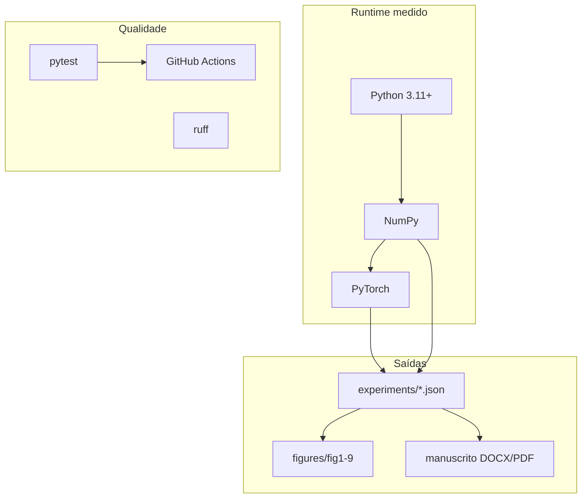

# Tecnologias — medido vs proposto (expandido)

Legenda: **[MEDIDO]** = usado nos JSON de `experiments/` · **[PROPOSTO]** = documentado, não executado neste artefato.

---

## Stack que de fato roda

| Tecnologia | Papel | Status |
|---|---|---|
| Python ≥ 3.11 | pacote `glue_lp` | **[MEDIDO]** |
| NumPy ≥ 1.26 | splits, features, RNG, GNN sintético | **[MEDIDO]** |
| PyTorch ≥ 2.1 | GCN / SAGE / GAT, Adam, BCE, `index_add_` | **[MEDIDO]** (séries 1–2, onda 3) |
| pytest | invariante, AUC, types, export, stubs | **[MEDIDO]** (CI) |
| matplotlib | figuras fig1–fig9 | **[MEDIDO]** (artefato) |
| python-docx + LibreOffice | manuscrito DOCX/PDF | **[MEDIDO]** (build; agente paralelo) |
| ruff | lint opcional | suporte |
| GitHub Actions | `pytest` em push | suporte |
| FastAPI + uvicorn | API read-only | **opcional** (não no núcleo) |

### Papel de cada camada no harness



---

## Proposto / não medido

| Tecnologia | Intenção | Status |
|---|---|---|
| PyTorch Geometric (PyG) | adapter Planetoid → protocolo | **[PROPOSTO]** stub `integrations/pyg_adapter.py` |
| DGL | segundo ABI; SpotTarget integra exclusão aqui | **[PROPOSTO]** stub `integrations/dgl_note.py` |
| OGB (`ogbl-*`) | Hits@K oficial, splits oficiais | **[PROPOSTO]** stub — **OGB não rodou** |
| NetworkX | grau/comunidades exploratório | **[PROPOSTO]** |
| Optuna | HPO hidden/lr/dropout | **[PROPOSTO]** |
| Weights & Biases | tracking remoto | **[PROPOSTO]** |
| GAT multi-head | 4–8 cabeças | **[PROPOSTO]** (medido: 1 cabeça) |
| GraphSAGE com amostragem | vizinhos S por camada | **[PROPOSTO]** (medido: média plena) |
| CUDA obrigatória | treino GPU | não exigido (Cora CPU ok) |
| SEAL / BUDDY / NCNC / LightGCN / Neo-GNN | scorers SOTA de LP | **fora do núcleo**; ver RELATED_WORK |

---

## Extras do `pyproject.toml`

```
pip install -e ".[torch]"  # PyTorch
pip install -e ".[docs]"   # python-docx, matplotlib
pip install -e ".[api]"    # fastapi, uvicorn
pip install -e ".[dev]"    # pytest, ruff
```

`requirements.txt` = stack batteries-included de treino + manuscrito.

---

## Complexidade (ordem de grandeza)

| Encoder | Por época (esparso) | Nota |
|---|---|---|
| GCN / SAGE / GAT | \(O((m+n)h + n h d)\) | Pubmed: evitar A denso (\(n^2 \approx 4\cdot 10^8\)) |
| CN / AA | \(O(\sum_u \mathrm{deg}(u)^2)\) típico | No mesmo \(Q\) do GNN |
| PA | \(O(\lvert Q\rvert)\) após graus | Mais sensível a L3 no sintético |

---

## Dependências científicas (não são pip)

Ver `RELATED_WORK.md`: VGAE (decoder), SpotTarget/HeaRT (diagnóstico), OGB (métricas futuras), Hevner/Peffers (método).
